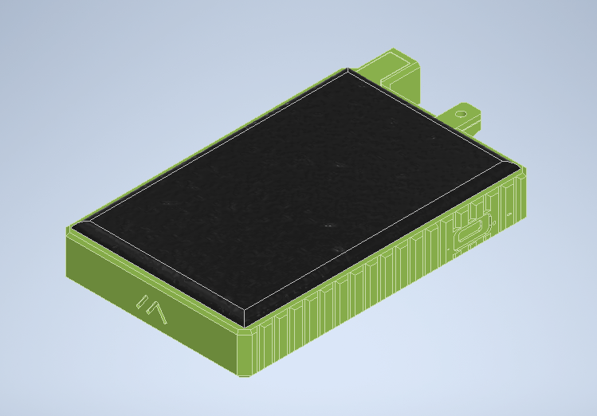
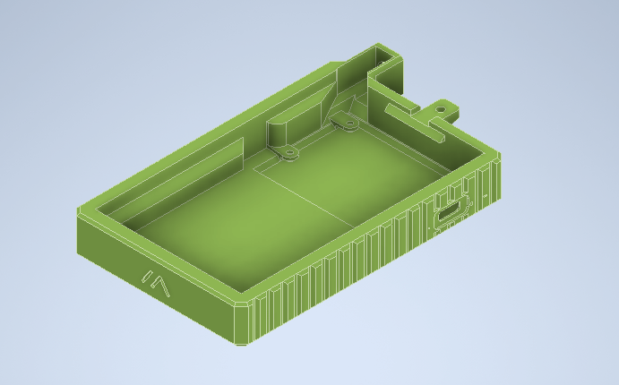
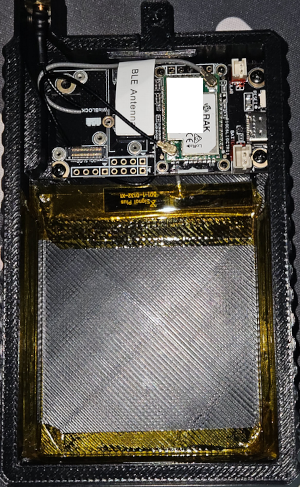
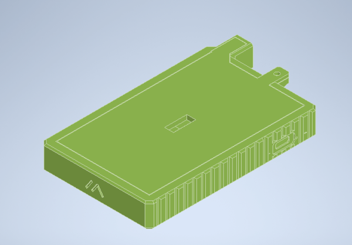
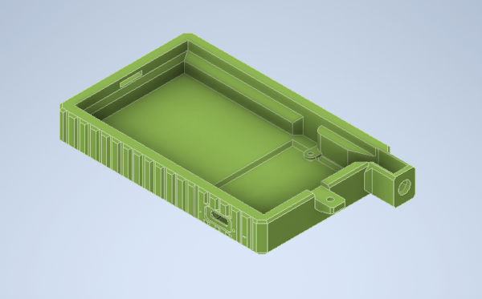
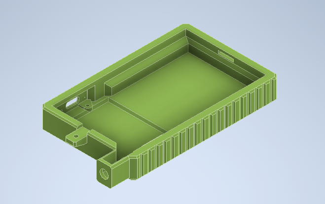
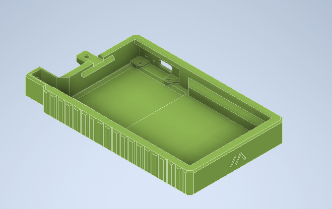

# Meshtastic-Portable
Another off-grid meshtastic case for the RAK4631

This utilises the RAK WisBlock Base Block with a RAK 4631 Module (nRF52 based LoRa).

3D Print the case with your filament of choice. If you anticipate it seeing more than 40 degree C days, I'd avoid PLA as it can distort.

- RAK Module (comes with Bluetooth antenng
- 955565 LiPo battery from online (9.5mm thick, 55mm wide, 65mm tall)
- 5dBi Antenna with u.FL to SMA Female cable
- 110mm by 69mm Solar Panel. I got a 5V 250mA panel

I used kapton tape to hold the battery in place, as well as line the inside of the print to reduce chances of puncturing the battery.

BT Antenna was stuck down using M3 adhesive on the bottom of the lowered area, between the battery and RAK WisBlock.

## Printing 
`.stp` files if you wish to edit

`.stl` files if you wish to print.

Note the USB C fit isn't perfect, you may need to shave down some sides of it to fit. Printer dependent.

Assembly should be pretty self explainatory. Slot down at an angle and close up. Screw with M3.

